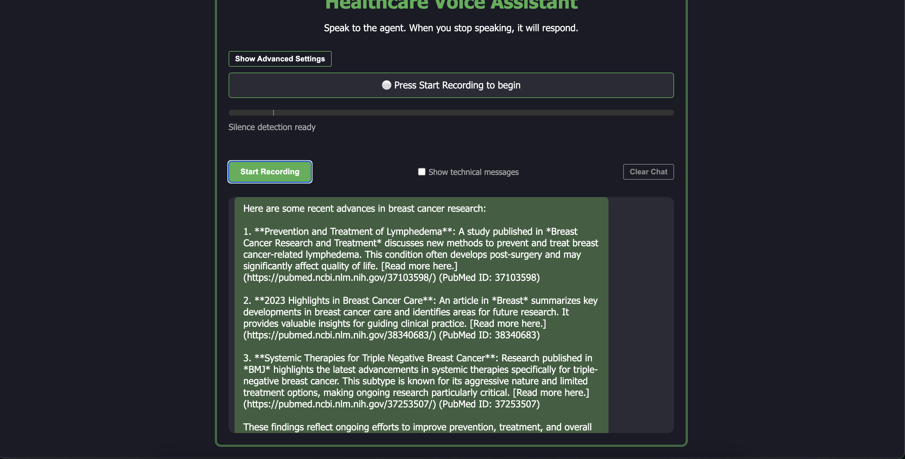

# OpenAI Voice Agent for Healthcare

The system processes spoken questions about health topics and provides relevant information through both text and synthesized speech responses using advanced OpenAI voice agent technology.

## Features

- Real-time voice input processing with OpenAI SDK integration
- Automatic routing to specialized healthcare voice agents (cardiology, neurology, nutrition, etc.)
- Text and voice responses powered by OpenAI's advanced language models
- Intelligent medical agent workflow for healthcare inquiries

## Screenshots




## Setup

## Installation

1. Clone the repository:
   ```bash
   git clone https://github.com/Mercurial-Ai/openai-agent.git
   cd openai-agent/openai-voice-agents-v2
   ```

2. Install the required dependencies:
   ```bash
   pip install -r requirements.txt
   ```

3. Make sure you have appropriate audio drivers installed for your system

## Usage

1. Run the application:
   ```bash
   python main.py
   ```
2. open url address
   ```bash
   http://localhost:8000
   ```

## OpenAI Voice Agent Workflow Explanation

The following explains how our advanced healthcare voice agent system processes speech-to-text (STT), OpenAI language model (LLM) answering, and text-to-speech (TTS) in a seamless medical assistant workflow.

### Complete OpenAI Voice Agent Workflow for Healthcare

#### Audio Capture (Browser-based Voice Agent Interface)
- User starts recording by clicking the button to activate the medical voice agent
- Browser captures microphone audio via Web Audio API for the healthcare voice assistant
- Real-time silence detection monitors when the user stops talking to the medical agent
- Audio is converted from Float32 to Int16 format and sent to server via WebSockets for OpenAI processing

#### Speech-to-Text Processing (OpenAI SDK Server)
- Server receives audio chunks via /ws WebSocket endpoint for the healthcare voice workflow
- Audio is fed into StreamedAudioInputWithEndDetection buffer using OpenAI agent technology
- When silence is detected, client signals "end_of_speech" to the medical voice assistant
- The VoicePipeline processes the audio stream for transcription in the healthcare agent workflow
- OpenAI's Whisper model converts speech to text for medical inquiry processing

#### Language Understanding & Response (OpenAI LLM Healthcare Agents)
- Transcription is passed to MyWorkflow.run() method in the medical agent system
- Text is added to conversation history in _input_history for contextual healthcare responses
- Runner.run_streamed() processes the query with the appropriate medical voice agent:
  - Main agent classifies the query using classify_medical_intent for healthcare routing
  - Query is routed to specialized OpenAI healthcare agents (cardiology, nutrition, mental health, etc.)
  - Agent uses OpenAI's GPT models to generate medically-relevant responses
  - Function tools (get_weather, get_health_info, etc.) provide external data to enhance the medical voice agent

#### Text-to-Speech Generation (OpenAI Voice Technology)
- Response text is streamed from the healthcare LLM via VoiceWorkflowHelper.stream_text_from()
- Server converts text to speech using OpenAI's advanced TTS API for natural-sounding medical responses
- Audio is buffered into reasonable chunks (about 200ms each) for smooth healthcare voice playback
- Audio data is sent back to client as binary WebSocket messages in the medical agent workflow

#### Audio Playback (Healthcare Voice Assistant Interface)
- Browser receives audio chunks from the medical voice agent and adds them to audioQueue
- processAudioQueue handles sequential playback of chunks for the healthcare assistant
- Each audio chunk is:
  - Converted from Int16 to Float32 format for optimal healthcare voice quality
  - Loaded into an AudioBuffer for the medical voice agent
  - Played through Web Audio API for clear medical information delivery
- System waits for each chunk to finish before playing the next in the healthcare voice workflow

#### Healthcare Voice Agent Conversation Flow
- After playback completes, system returns to listening mode for continued medical assistance
- restartListening() resets the UI to accept new input for the healthcare voice agent
- Conversation history is maintained for context in future healthcare exchanges with the OpenAI agent

##### Healthcare Voice Agent Workflow Diagram
[User] → Microphone → [Browser] → WebSocket → [Server]
                                              ↓
                                          Audio Buffer
                                              ↓
                                      Speech-to-Text (STT)
                                              ↓
                                      Transcription Text
                                              ↓
                          ┌─────────────LLM Processing──────────────┐
                          │                                         │
                          ↓                                         ↓
                    Main Agent─────────────┬───────────Specialized Medical Agents
                                           │                 │
                                           ↓                 ↓
                                      Function Tools     Healthcare Tools
                          │                                         │
                          └─────────────────────────────────────────┘
                                              ↓
                                       Response Text
                                              ↓
                                    Text-to-Speech (TTS)
                                              ↓
                                        Audio Chunks
                                              ↓
[User] ← Speaker ← [Browser] ← WebSocket ← [Server]


### 1️⃣ General Cancer Information
What is cancer, and how does it develop?

What are the most common types of cancer?

What are the early signs and symptoms of cancer?

How is cancer diagnosed?

What are the common causes and risk factors for cancer?

Is cancer hereditary?

### 2️⃣ Diagnosis & Testing
What tests are used to diagnose cancer?

How accurate are cancer screenings?

What is a biopsy, and how does it work?

What are tumor markers, and how are they used?

What do my test results mean?

How do doctors determine the cancer stage?

### 3️⃣ Cancer Treatment Options
What are the main treatments for cancer?

What is chemotherapy, and how does it work?

What is radiation therapy, and when is it used?

What are targeted therapies, and how do they work?

How does immunotherapy help fight cancer?

What are the benefits and risks of surgery for cancer?

How is palliative care used in cancer treatment?

### 4️⃣ Side Effects & Management
What are the common side effects of chemotherapy?

How can I manage nausea and vomiting during treatment?

What should I eat to maintain strength during treatment?

How can I deal with cancer-related fatigue?

What are the long-term effects of cancer treatment?

How can I cope with hair loss due to chemotherapy?

### 5️⃣ Cancer & Lifestyle
What foods help fight cancer?

Is exercise safe for cancer patients?

How does stress affect cancer?

Can alternative therapies like yoga or acupuncture help cancer patients?

How does sleep impact cancer recovery?

### 6️⃣ Support & Mental Health
How can I manage anxiety and depression after a cancer diagnosis?

Where can I find support groups for cancer patients?

How can I talk to my family about my cancer diagnosis?

What are some coping strategies for dealing with cancer?

### 7️⃣ Post-Treatment & Survivorship
How do I know if my cancer is in remission?

What follow-up tests do I need after cancer treatment?

What are the chances of cancer recurrence?

How can I regain strength after treatment?

### 8️⃣ Cancer Prevention & Screening
What lifestyle changes can help prevent cancer?

How often should I get screened for cancer?

Are there vaccines that help prevent cancer? (e.g., HPV, Hepatitis B)

### 9️⃣ Personalized Care & AI Support
How can AI help in cancer diagnosis and treatment?

Can an AI assistant help me track my symptoms?

How can AI improve my healthcare experience?

Can AI suggest clinical trials for my condition?

